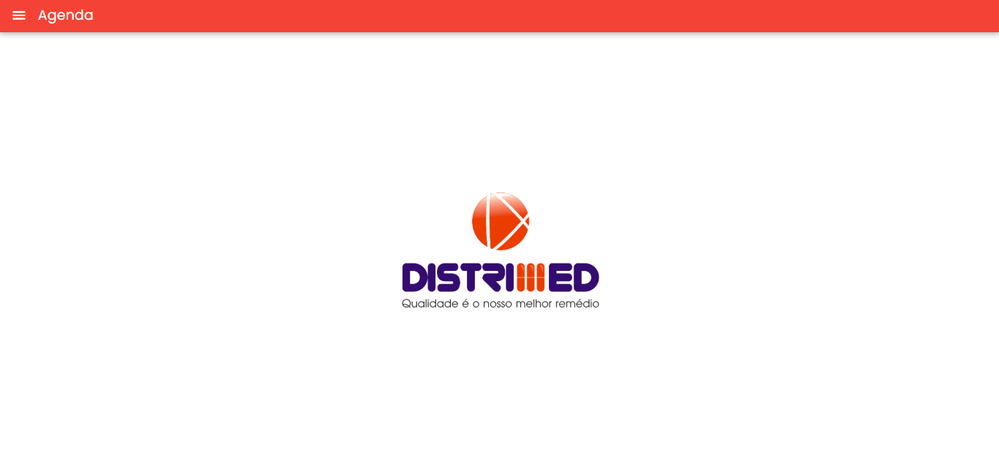
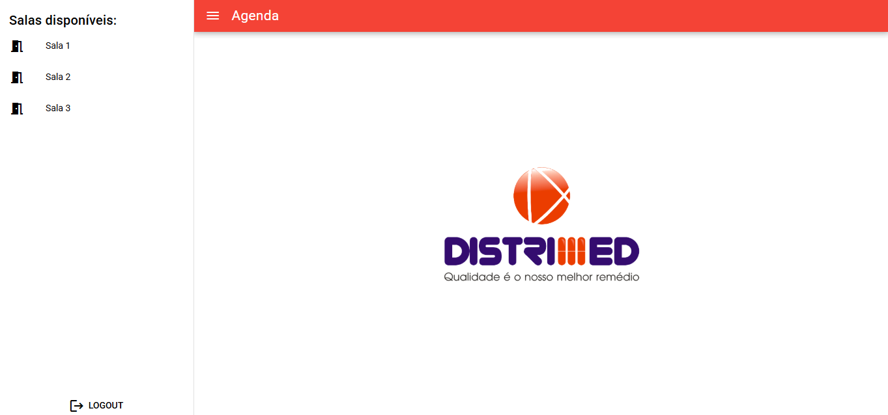
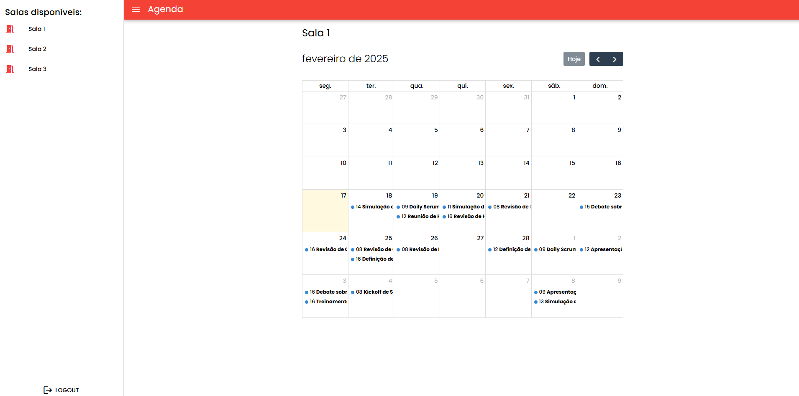
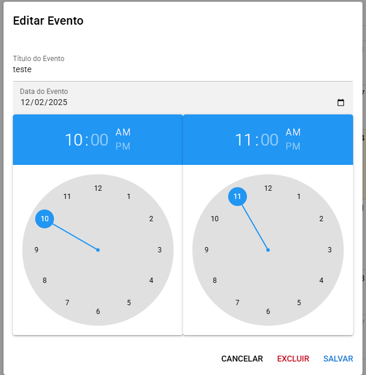
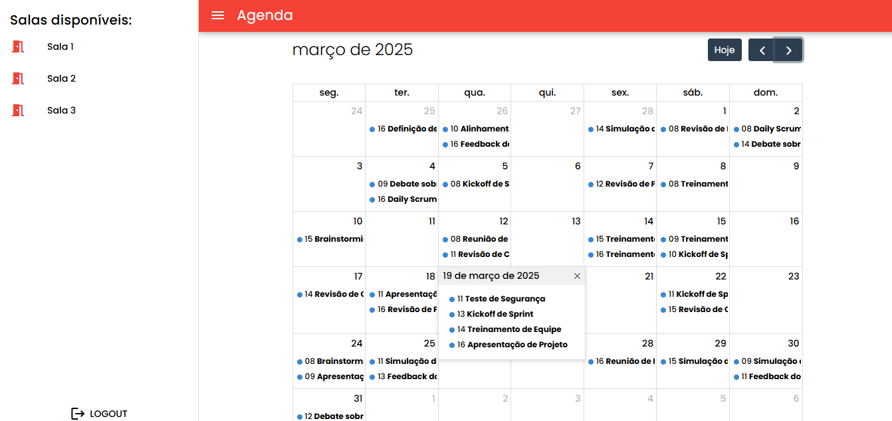
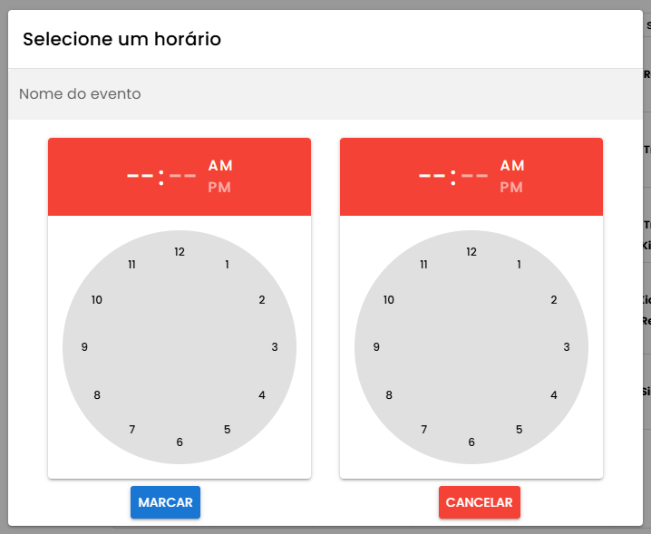

# 🏢 Sistema de Agendamento de Salas de Reunião

## 📌 Introdução
O **Sistema de Agendamento de Salas de Reunião** permite que os usuários realizem reservas de três salas disponíveis em um ambiente corporativo. O sistema possui uma interface interativa e intuitiva, além de uma API organizada e funcional.

---

## 🚀 Tecnologias Utilizadas

### 📌 **Frontend**
- [Vue 3](https://vuejs.org/)
- [Quasar Framework](https://quasar.dev/)
- [FullCalendar](https://fullcalendar.io/) (Visualização do Calendário)
- [Axios](https://axios-http.com/docs/intro/) (Integração com Backend em Express)
- [Pinia](https://pinia.vuejs.org) (Gerenciamento de Estado)

### 📌 **Backend**
- [Node.js](https://nodejs.org/)
- [Express.js](https://expressjs.com/)
- [SQLite](https://www.sqlite.org/) (Banco de Dados leve e eficiente)

### 📌 **Controle de Versão**
- [Git](https://git-scm.com/)
- [GitHub](https://github.com/) (Repositório público para o projeto)

---

## 🔧 Como Rodar o Projeto Localmente

### 📥 **1. Clonando o Repositório**
```sh
  git clone https://github.com/pedromends/distrimed-agenda.git
  cd repositorio
```

### 📦 **2. Instalando Dependências**
#### 📌 Backend
```sh
  cd backend
  npm install
```
#### 📌 Frontend
```sh
  cd distrimed-front
  npm install
```

### ▶ **3. Executando o Projeto**
#### 📌 Backend
```sh
  cd backend
  node server.js
```
#### 📌 Frontend
```sh
  cd distrimed-front
  quasar dev
```

---

## 📂 Estrutura do Código

### 📁 **Frontend** (`/frontend`)
- 📌 `src/components/` - Componentes reutilizáveis
- 📌 `src/pages/` - Páginas principais (Login, Dashboard, Salas)
- 📌 `src/router/` - Definição das rotas Vue Router
- 📌 `src/store/` - Gerenciamento de estado com Pinia
- 📌 `src/layouts/` - Layouts principais do Quasar
- 📌 `src/services/` - Implementação das rotas a partir do Axios

### 📁 **Backend** (`/backend`)
- 📌 `server.js` - Arquivo principal do servidor Express
---

## 🛠️ Funcionalidades Implementadas

### 🔑 **Autenticação**
✅ Simulação de login com autenticação por email e senha.

### 🏢 **Gestão de Salas**
✅ Listagem das três salas de reunião.
✅ Interface intuitiva para selecionar e reservar uma sala.
✅ Integração com um calendário interativo (FullCalendar).

### 📅 **Agendamento de Reuniões**
✅ Seleção de:
- Sala desejada 🏢
- Data e horário de início ⏳
- Data e horário de término ⏳

✅ **Validações:**
- ❌ Evita agendamentos no passado.
- ❌ Impede reservas para salas já ocupadas.
- ❌ Exige que o horário de início seja anterior ao de término.

### 📜 **Listagem de Agendamentos**
✅ Exibição de todas as reservas no calendário.
✅ Opção para cancelar uma reserva (somente pelo usuário que criou).

### ❌ **Cancelamento de Reuniões**
✅ Apenas o criador do evento pode cancelá-lo.

---

## 🔗 API REST (Backend)

### 📌 **Endpoints**
| Método | Rota | Descrição |
|---------|------|-------------|
| GET | `/get-by-email` | Recupera ID no usuário com base no email. |
| GET | `/meetings` | Lista todas as reuniões agendadas. |
| POST | `/meetings` | Atualiza de uma só vez todas as alterações realizadas no calendário. |
| POST | `/login` | Autentica usuário no Banco de Dados com base em email e senha. |
| POST | `/register` | Registra novo usuário no banco de dados. |

---

## 🏆 Critérios de Avaliação Requisitados
✅ **Código Limpo e Bem Estruturado**
✅ **Uso correto do Quasar e Vue 3**
✅ **API REST organizada e bem estruturada**
✅ **Interface intuitiva e amigável**
✅ **Calendário interativo bem integrado**
✅ **README detalhado (este documento)**

---

# Imagens do sistema

Aqui estão algumas imagens inseridas no Markdown:

### Imagem 1: Landing Page


### Imagem 2: Salas Disponíveis


### Imagem 3: Agenda da Sala 1


### Imagem 4: Editar evento existente


### Imagem 5: Eventos de 1 determinado dia


### Imagem 6: Criação de evento



## 🔗 Link do Repositório
[🔗 GitHub - Repositório do Projeto](https://github.com/pedromends/distrimed-agenda.git)

📌 **Criado por** João Pedro Souza 🎯

